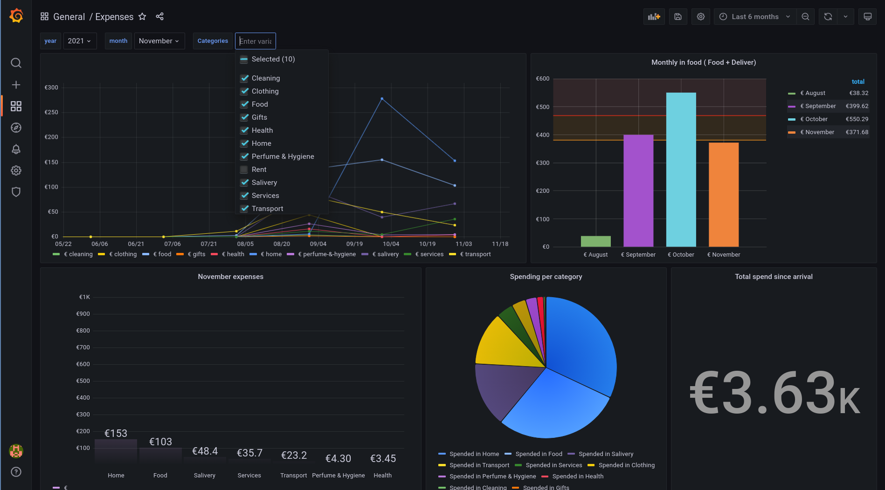

# Expense App
My new excuse to keep on learning DDD and write some Go code. Don't expect much doc.

It's just an API made with [Fiber](https://github.com/gofiber/fiber) and [Gorm](https://gorm.io/) (probably not the best decision) which aims the help you with tracking expenses and let's you interact with them on [Grafana](https://grafana.com/)

## Features
* Import expenses from different source
    * Google sheets (you will need a [service account](https://cloud.google.com/iam/docs/creating-managing-service-account-keys#iam-service-account-keys-create-gcloud) and share you spread sheet with it.
    * Sample Data ([exampleImporter.go](https://github.com/contre95/expenses-app/blob/main/pkg/gateways/importers/exampleImporter.go)) 
* Add / Delete individual expenses (TODO)


# Configurations
All configurations are set in the `.env` file and passed as environment variables
```sh
# Set the .env
mv .env.example .env
# Install the dependencies
go mod tidy
# Source the env variables
. <(cat .env | grep -v -e '^$' | grep -v "#" | awk '{print "export " $1}')
```

# Run 
```sh
# Development environment
docker-compose up -d
# The app
go run main.go
```

# Endpoints

### Login
```sh
# Request /login
curl -d "user=admin&pass=secretpass" -X POST http://localhost:3000/login | jq
# Response
#   {
#     "token": "<jwt>"
#   }
```
### Google Sheets Importer
```sh
# Request /importers/:importer_id
JWT=$(curl -d "user=admin&pass=secretpass" -X POST http://localhost:3000/login | jq ".token" | tr -d '"')
curl -H "Authorization: Bearer $JWT" \
     -d '{ "bypass_wrong_expenses": true }' \
     -H "Content-Type: application/json" \
     -X POST http://localhost:3000/importers/sheets | jq
# Response
#   {
#     "err": null,
#     "msg": {
#       "Msg": "All the expenses where imported",
#       "SuccesfullImports": 206,
#       "FailedImports": 0
#     },
#     "success": true
#   }
```

### Healthcheck
```sh
# Request /ping
curl -H "Content-Type: application/json" -X GET http://localhost:3000/ping | jq
# Response
#   {
#     "ping": "pong"
#   }
```
   
# Dashboards example

A Grafana dashboard is automatically created and can be accesses from [localhost:8080](http://localhost:8080)

### Expenses dashboard


# TODO   

* Users
    * Implement JSON Storage for users
    * Validate user:password for users
    * CreateUser use case   
   
   
